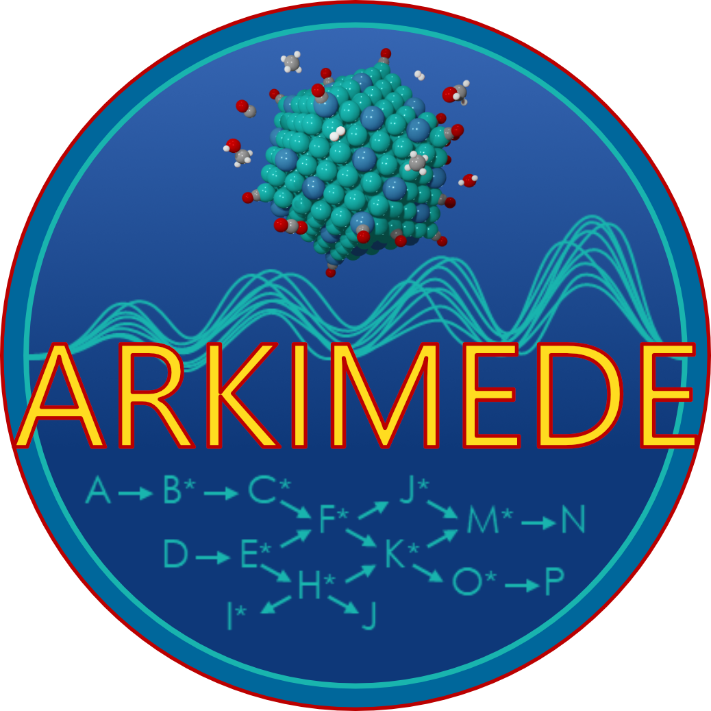

<p align="center">
  
</p>

# ARKIMEDE
**Automatic Reaction KInetic MEchanism DEsign**

ARKIMEDE is a Python framework for studying catalytic reactions on solid surfaces. It combines **transition-state (TS) searches**, **machine-learning potentials (MLPs)**, and **density-functional theory (DFT) calculations** within unified workflows based on the **Atomic Simulation Environment (ASE)**. The goal of ARKIMEDE is to facilitate the systematic exploration of catalytic mechanisms of surface reactions with efficient TS-search algorithms and active-learning strategies.

---

## Installation

Clone and install the repository:
```bash
git clone https://github.com/raffaelecheula/arkimede.git
cd arkimede
pip install -e .
```

---

## Dependencies

Core dependencies:
- NumPy
- SciPy
- Matplotlib
- Atomic Simulation Environment (ASE)

Other dependencies:
- Sella
- MLP codes (CHGNet, MACE, OCP, FAIRChem)
- DFT codes (Quantum Espresso, VASP)
- PyYAML

---

## Examples

The `examples` directory contains tutorial-style workflows.

#### 01 — TS searches with MLPs
Run TS searches using universal MLPs (CHGNet, MACE, OCP, FAIRChem). First, the initial and final states of elementary reactions are relaxed. TS guess structures are then generated using the IDPP interpolation method. Optionally, NEB calculations can be performed to improve the TS guesses. Finally, single-structure TS-search methods (Dimer, ARPESS, Sella, and BA-Sella) are used to calculate TS structures and energies.

#### 02 — Optimization with DFT
Run single-structure TS searches with DFT (Quantum Espresso or VASP), starting from TS guess structures obtained with the IDPP interpolation method.

#### 03 — Optimization with DFT after MLP
Run single-structure TS searches with DFT (Quantum Espresso or VASP), starting from TS guess structures obtained with TS searches using a MLP.

#### 04 — Sequential active learning
Run active learning TS searches, in which MLPs are iteratively fine-tuned using forces evaluated with DFT single-point calculations. A different MLP is fine-tuned for each TS structure.

#### 05 — Batch active learning
Run active learning TS searches, in which MLPs are iteratively fine-tuned using forces evaluated with DFT single-point calculations. The same MLP is fine-tuned using data from all TS structures.

---

## Contributing

Contributions are welcome. Possible contributions include:
- Reporting bugs
- Improving documentation
- Adding workflows
- Providing new examples

To contribute:
- Fork the repository
- Create a new branch
- Commit your changes
- Open a pull request

---

## License

ARKIMEDE is released under the **GPL-3.0 License**. See the `LICENSE` file for details.

---

## Author

**Raffaele Cheula**
email: cheula.raffaele@gmail.com

---
